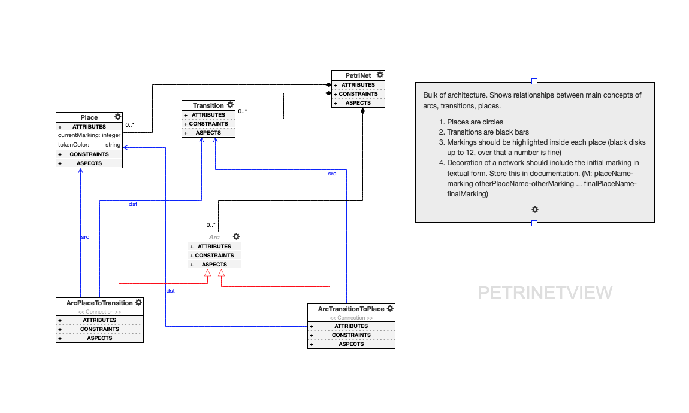
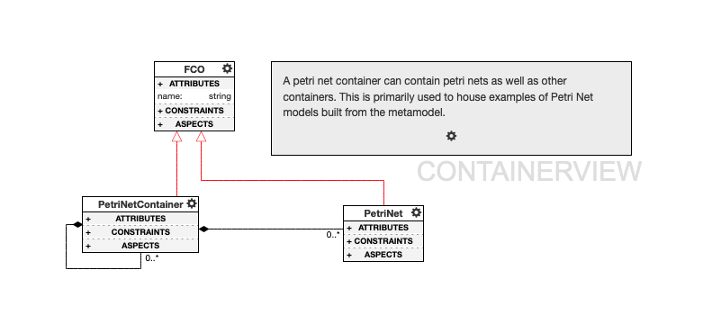

# Development Process

I'm including this file for my future self to reference as a reminder of the process of creating the design studio, the visualizer, the decorations, the plugin, the seed, and the petri net metamodel.

## Seed Project - The Petri Net Metamodel

I first created a project seed from the public WebGME instance we've been using at [https://mic.isis.vanderbilt.edu/](https://mic.isis.vanderbilt.edu/).
Project seed included foundational architecture of the Petri Net Meta Model. Below are some screenshots of the various views created within the seed project.
After creating the seed, I exported it via the `master > Export branch` feature in the top nav, stored it within this project such that it could be read in as a seed.

## Building the Metamodel

Below is an outline of the different views you will find in the `Meta` visualizer, where each view focuses on specific concepts and their relationships.


### METAView

Top level view showing that the Petri Net Metamodel both IS an FCO (first class object) and can CONTAIN other FCO concepts.


### PetriNetView

The bulk of the architecture for the metamodel; highlights relationships between transitions, arcs, and places.



### DocsView

A view focused on the (simple) `Documentation` concept for storing documentation about a model.


### ContainerView

A view focused on the `PetriNetContainer` concept. A petri net container can contain petri nets as well as other petri net containers. Primarily used to house examples of Petri Net models built from the metamodel.



## Creating the Seed

To create the seed such that it would show up in the seed choices when creating a new project at `http://localhost:8080`, I took the following steps:

1. I created the folder `seeds` within the `src` folder and placed the exported webgmex file in that folder with the name `PetriNetSeed.webgmex`
2. In order to include that new folder in the "seed search", if you will, I added

```
config.seedProjects.basePaths.push('src/seeds')
```

to the [config.webgme.js](petri-net/config/config.webgme.js) file.

3. I restarted the server.
4. I then made sure it worked by creating a new project and choosing the `PetriNetSeed` option from the seed choices.

## Development Environment Setup

The below are the steps taken to set up a local WebGME development environment on my late 2012 iMac.

1. Install, activate Node JS v 18.0.0
   1. `nvm install 18 && nvm use 18`
2. Update NPM to latest version 8.15.1
   1. `npm install -g npm@8.15.1`
3. Install [MongoDB](https://www.mongodb.com/)

- This project will not work with new versions of Mongo. You need a version before 5.0 which deprecated the use of OP_QUERY command: find. Example: `brew install mongodb-community@4.4` Otherwise you will get error:

```
{
  metadata: {
    name: 'MongoError',
    message: 'Unsupported OP_QUERY command: find. The client driver may require an upgrade. For more details see https://dochub.mongodb.org/core/legacy-opcode-removal',
    ok: 0,
    errmsg: 'Unsupported OP_QUERY command: find. The client driver may require an upgrade. For more details see https://dochub.mongodb.org/core/legacy-opcode-removal',
    code: 352,
    codeName: 'UnsupportedOpQueryCommand'
  }
}
```

4. Install `webgme-cli` as a global npm module
   1. `npm install -g webgme-cli`
5. Created project with:
   1. `webgme init petri-net` which outputs:

```
Start your WebGME app with 'webgme start' from the project root.
It is recommended to run 'npm init' from the within project to finish configuration.
```

5. Ran `npm init` from within the new `petri-net` folder as indicated above. Used mostly default values, except for GitHub repository, keywords, and author.
6. Started project with `webgme start` from within `petri-net` folder.

## Decorations

I didn't create my own custom decorator, and instead just used the SVG Decoration following [this tutorial on YouTube on Dynamic SVG Rendering in WebGME with EJS](https://www.youtube.com/watch?time_continue=1&v=l5m4CF4w8fE&feature=emb_logo).

Below is an outline of the specific decorations that were implemented to achieve the requirements.

- [Places](petri-net/src/decorators/PetriNetDecorator/Icons/Place.svg) are circles containing <MARKING> tokens. SVG Decorator used with [EJS](https://ejs.co) to dynamically render up to 12 "token" discs (where the number of discs is the marking for the place) inside of a Place circle. When the marking of a place exceeds 12, it just prints a number inside the place circle. Token disc color can be customized with the `tokenColor` attribute of each place. Default is black.
- [Transitions](petri-net/src/decorators/PetriNetDecorator/Icons/Transition.svg) are squares, created with SVG decorator. No EJS necessary since nothing needs to be dynamically rendered.
- [Petri Nets](petri-net/src/decorators/PetriNetDecorator/Icons/PetriNet.svg) are decorated with a network icon supplemented with a textual description of the initial marking formatted as follows:

```
M: placeName-marking otherPlaceName-otherMarking ... finalPlaceName-finalMarking
```

This initial marking description took a bit of logic to build out using [EJS](https://ejs.co) as part of the SVG Decorator. The marking description on the backend uses in matrices and out matrices to first try to build an ordered string of the places if the petri net has a "start" Place (out flow only with no in flow); if there is no start place meeting that criteria, it starts from a random place. The string builder uses [breadth-first traversal](https://www.geeksforgeeks.org/breadth-first-search-or-bfs-for-a-graph/) of the network and avoids infinite loops by skipping already-traversed places.

### Simulation Visualizer

Next step: simulating behavior! Requirements of the simulator:

- Should visualize the network similarly to the composition: SATISFIED
- Additionally, it should differentiate the transitions that are enabled: SATISFIED, achieved with coloring and CSS-keyframe-animations for pulsating effect on enabled transitions
- Firing should happen once the user clicks on an enabled transition: SATISFIED, with additional option of "firing all enabled transitions simultaneously"
- Markings should progress according to firings (no animation is required, but would be nice): SATISFIED
- The visualizer should have a ‘reset’ button on its toolbar that switches the network back to the initial marking: SATISFIED
- The state of the simulation should not be reflected in the model: SATISFIED, only the .joint (the visualization) is changed
- If your network reaches a deadlock (there is no enabled transition), some visual effect should notify the user (or an actual notification...): SATISFIED

To do this, as documented [here](https://github.com/webgme/webgme/wiki/GME-Visualizers), I decided to use the `webgme new viz` command using the webgme CLI tool. When checking options with the `--help` flag, I got this response:

```
(base) huntaj-imac:petrinet-designstudio huntaj$ webgme new viz --help

  Usage: webgme-new-viz [options] <visualizerID>

  Options:

    -h, --help               output usage information
    --name <visualizerName>  Set the visualizer name. Default is the id
    --secondary              Create visualizer not used for active node visualization
```

So, I need to create a primary visualizer for Simulation, but it looks like I'll need secondary visualizers for the additional UI pieces like the 'reset' button.

To create a primary visualizer with an ID of `SimViz`:

```
webgme new viz SimViz
```

I then created [Visualizers.json](petri-net/src/visualizers/Visualizers.json) with the following content:

```
[
  {
    "id": "SimViz",
    "title": "SimViz",
    "panel": "panels/SimViz/SimVizPanel",
    "DEBUG_ONLY": false
  }
]
```

I also had to manually update the WebGME Config file [config.webgme.js](petri-net/config/config.webgme.js) to include the following, otherwise the visualizer is completely ignored:

```
// panels
config.visualization.panelPaths.push(__dirname + "/../src/visualizers/panels");
// visualizer descriptors
config.visualization.visualizerDescriptors.push(
  `${__dirname}/../src/visualizers/Visualizers.json`
);
// Add requirejs paths
config.requirejsPaths = {
  panels: "./src/visualizers/panels",
  widgets: "./src/visualizers/widgets",
  statemachinejoint: "./src/common",
};
```

I then restarted the server with `CTRL+C` and `webgme start`. To verify the addition of the new visualizer, I went to the `PetriNet` meta type, opened the `Meta` tab, selected the `...` icon under `validVisualizers`, and checked for `SimViz` in the `Available` column:


I added the `SimViz` visualizer directly underneath the `ModelEditor` visualizer in the Chosen column so it can appear as the second visualizer for all Petri Net model instances.

I used [Tamas Kecskes's StateMachineJoint example on GitHub](https://github.com/kecso/StateMachineJoint/blob/main/src/visualizers/panels/SimSM/SimSMControl.js) to provide a foundation for my [SimVizControl.js](petri-net/src/visualizers/panels/SimViz/SimVizControl.js) file, then proceeded to modify and customize based on my own domain; the example focuses on simulating State Machines specifically which are [different from Petri Nets](https://stackoverflow.com/questions/53980748/whats-the-difference-of-petri-nets-and-finite-state-machines).

Needed to install JointJS with `npm i jointjs`, then add these lines to [config.default.js](petri-net/config/config.default.js):

```
// Paths needed for proper jointjs import on the client side
config.requirejsPaths["jointjs"] = "./node_modules/jointjs/dist/joint.min";
config.requirejsPaths["lodash"] = "./node_modules/lodash/lodash.min";
```

and then restarted the web server to apply the updates.

### PetriNetCategorizer Plugin

I wanted to create a plugin for categorizing a given petri net into one or more of the following categories: `Workflow net`, `State machine`, `Free choice petri net`, and `Marked graph`. To do this, I first ran the following `webgme-cli` command:

```
webgme new plugin --language=JavaScript PetriNetClassifier
```

I then added the following line to [config.webgme.js](petri-net/config/config.webgme.js):

```
config.plugin.basePaths.push(__dirname + "/../src/plugins");
```

I chose JS instead of Python because I've become quite a fan of the syntactic sugar offered by JS and the simplicity that it offers especially when it comes to traversing data structures.

The plugin source code is in [petri-net/src/plugins/PetriNetClassifier/PetriNetClassifier.js](petri-net/src/plugins/PetriNetClassifier/PetriNetClassifier.js). It primarily handles classification of a given Petri Net into one of the aforementioned classes; each positive classification triggers a notification that appears in the `NOTIFICATIONS` bar on the bottom right. The plugin can be triggered by opening the `SimViz` visualizer for any given Petri Net model instance and clicking the `Classify!` button in the top left in the toolbar. A screenshot is shown below of this using the Krebs Cycle model instance as an example.


## Logical Issue

After some extensive testing and building out various examples, particularly the more complex real-world examples, I noticed an issue associated with the **simultaneous firing** option that I implemented. This feature causes problems in situations where a Place has at least one token but fewer tokens than outTransitions. If this is true, each of the outTransitions is enabled because the Place has at least one token, but if you choose to "Fire all transitions simultaneously" then each of those outTransitions will try to decrement the token count of the Place by one, resulting in a negative token value at that place. Obviously, this situation really should not arise, and it would not arise if I removed the ability to simultaneously fire transitions. This is because if you were to fire only one transition at a time, then the Place's token value would update one at a time and would never drop below zero. An alternative fix to this would be to still allow "firing all enabled transitions" but randomly interleaving the firing of those transitions such that really only one fires at a time, then the "enabled" status updates for all, then the next fires, etcetera. In short, with simultaneous firing, multiple "competing" transitions can falsely assume that there are sufficient tokens at a shared inplace and can produce problems with the token value decrementing.

## NodeJS Version Issue

I ran into a strange problem with NodeJS v18.0.0. Running WebGME with v18 works almost perfectly unless you want to export a project (create a new seed from a webgmex file). On my iMac 2012 (macOS Catalina), I had to fall back to NodeJS v14 and reinstall NPM packages in order for the export feature to work properly. When doing this, I also had to use `npm start` instead of `webgme start` in order to start the server to produce the export.
