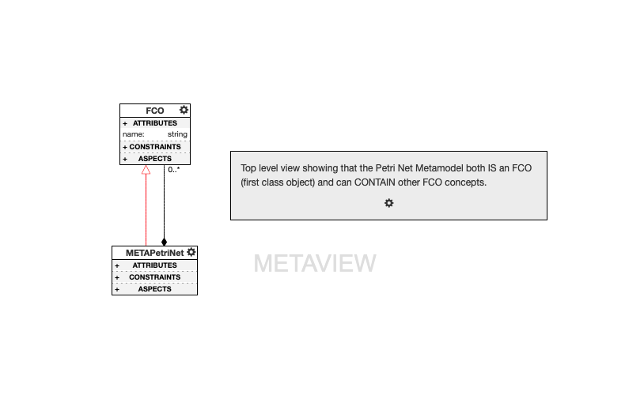

# Petri Net Design Studio

This is a project focused on creating a design studio with special attention to the concept of a [Petri Net](https://en.wikipedia.org/wiki/Petri_net), one of several mathematical modeling languages for describing distributed systems. In this project, I use [NodeJS](https://nodejs.org/en/) and [WebGME](https://webgme.readthedocs.io/) heavily to create a custom design studio that not only allows for modeling Petri Net structure (i.e. relations between transitions, places, and arcs), but also for modeling Petri Net behavior via custom simulation visualizers built with [JointJS.](https://www.jointjs.com/)

## Seed Project - The Petri Net Metamodel

I first created a project seed from the public WebGME instance we've been using at [https://mic.isis.vanderbilt.edu/](https://mic.isis.vanderbilt.edu/).
Project seed included foundational architecture of the Petri Net Meta Model. Below are some screenshots of the various views created within the seed project.
After creating the seed, I exported it via the `master > Export branch` feature in the top nav, stored it within this project such that it could be read in as a seed.

### METAView

Top level view showing that the Petri Net Metamodel both IS an FCO (first class object) and can CONTAIN other FCO concepts.



### PetriNetView

The bulk of the architecture for the metamodel; highlights relationships between transitions, arcs, and places.


### DocsView

A view focused on the (simple) `Documentation` concept for storing documentation about a model.


### ContainerView

A view focused on the `PetriNetContainer` concept. A petri net container can contain petri nets as well as other petri net containers. Primarily used to house examples of Petri Net models built from the metamodel.


## Creating the Seed

To create the seed such that it would show up in the seed choices when creating a new project at `http://localhost:8888`, I took the following steps:

1. I created the folder `seeds` within the `src` folder and placed the exported webgmex file in that folder with the name `PetriNetProjectSeed.webgmex`
2. In order to include that new folder in the "seed search", if you will, I added

```
config.seedProjects.basePaths.push('src/seeds')
```

to the [config.webgme.js](petri-net/config/config.webgme.js) file.

3. I restarted the server.
4. I then made sure it worked by creating a new project and choosing the `PetriNetProjectSeed` option from the seed choices.

## Development Environment Setup

The below are the steps taken to set up a local WebGME development environment on my late 2012 iMac.

1. Install, activate Node JS v 18.0.0
   1. `nvm install 18 && nvm use 18`
2. Update NPM to latest version 8.15.1
   1. `npm install -g npm@8.15.1`
3. Install `webgme-cli` as a global npm module
   1. `npm install -g webgme-cli`
4. Created project with:
   1. `webgme init petri-net` which outputs:

```
Start your WebGME app with 'webgme start' from the project root.
It is recommended to run 'npm init' from the within project to finish configuration.
```

5. Ran `npm init` from within the new `petri-net` folder as indicated above. Used mostly default values, except for GitHub repository, keywords, and author.
6. Started project with `webgme start` from within `petri-net` folder.

## Steps

### Decorators

I want to use a custom decorator for this project, called something like `PetriNetDecoratorr` to enable dynamic SVG-based rendering for different objects based on attribute values. To do this, I followed [this Decorator documentation.](https://github.com/webgme/webgme/wiki/GME-Decorators) in combination with [this YouTube tutorial on Dynamic SVG Rendering in WebGME](https://www.youtube.com/watch?time_continue=3&v=l5m4CF4w8fE&feature=emb_logo) This tool already appends `Decorator` to the end of the provided name, so I used:

```
webgme new decorator PetriNet --inherit
```
